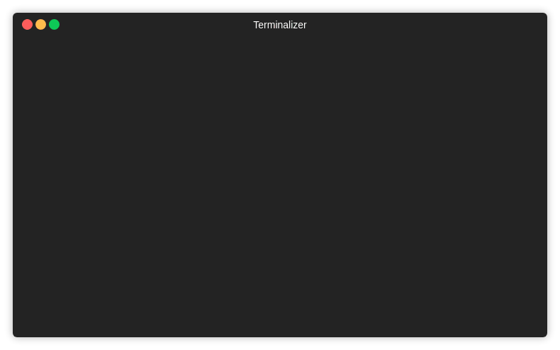

# tblue
> Trello blueprints, scaffolding for trello boards (a.k.a. yeoman for trello)



## Motivation
If you use trello a lot, it's likely that you have common tasks based on past experience and also custom cards for this project only. Wouldn't it be nice to have some sort of blueprint or template we could use to bootstrap our boards? This project aims to solve this need.

## 🔧 Setup
This project requires 2 environment variables set. Please add them to your .bash_profile or wherever they are needed for your environment. Next you'll find which variables you need to set and what value you should use for each one.

(You can optionally just run `tblue` and the cli will guide you 😉)

### TRELLO_API_KEY
Log into trello and copy the developer key from https://trello.com/app-key. Use that value for this environment variable.

### APP_TOKEN
Use your api key from last step and replace it into the next url https://trello.com/1/authorize?key=**API_KEY**&name=tblueScaffoldingForTrello&expiration=never&response_type=token&scope=read,write

Now copy/paste the full url into your browser

Grant access to the script so you get a token, only you know what this token is so only your local instance of `tblue` will use it.

Now place the token as the value for this environment variable.

## 🏃 How to run
```bash
npm install -g tblue
tblue
```

## 📜 Workflow
1. Choose a name for your board
2. Choose which blueprint you want to use
3. Start answering Y/n for each question in the blueprint
4. Start adding features
5. See your new board 👶

## CLI options
`-c` OR `--custom-blueprints-folder`: Allows passing a folder containing one or multiple blueprints (see Custom blueprints). Only the files immediately inside the folder that have a `.json` extension and have a valid template will be evaluated.

### Custom blueprints
The custom blueprints you create must have the following format. **If they don't, they will not show up in the blueprints selection screen**.
```json
{
    //Name that will be prompted in the CLI
    "name": "Simple API",

    //Questions that could generate a card according to your project's need
    "questions": [
        {
            "content": "Will you be using Docker?",
            "cardToGenerate": {
                "name": "Create Docker configuration"
            }
        },
    ],

    //These are cards that will always be generated when you use this blueprint
    "cards": [{"name": "Repository configuration"}]
}
```

## Running locally
```bash
npm install
npm start
```

## Run tests
```bash
npm test
```

## Compatibilty
Emojis don't show correctly in windows 💔

## Contributing blueprints
For the moment, if you'd like to contribute a blueprint please submit a PR to the `src\blueprints\` folder. I plan to extract the blueprint to either a cdn or other option.
